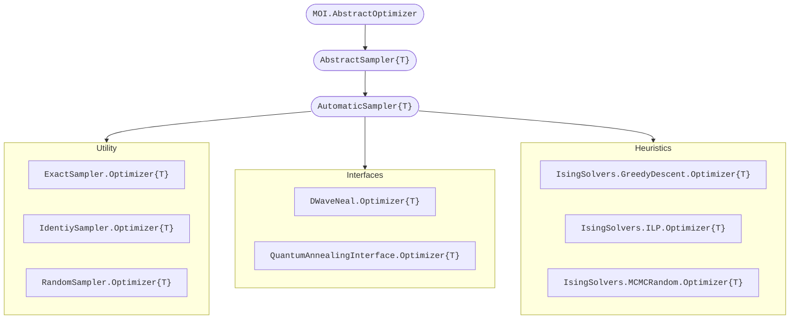

# Anneal.jl 🔴🟢🟣🔵

<div align="center">
    <a href="/docs/src/assets/">
        
    </a>
    <br>
    <br>
    <a href="https://codecov.io/gh/psrenergy/Anneal.jl">
        
    </a>
    <a href="https://psrenergy.github.io/Anneal.jl/dev">
        
    </a>
    <a href="https://github.com/psrenergy/Anneal.jl/actions/workflows/ci.yml">
        
    </a>
    <a href="https://doi.org/10.5281/zenodo.6390515">
        
    </a>
</div>

## Introduction
This package aims to provide a common [MOI](https://github.com/jump-dev/MathOptInterface.jl)-compliant API for [QUBO](https://en.wikipedia.org/wiki/Quadratic_unconstrained_binary_optimization) Sampling & Annealing machines. It also contains a few testing tools, including utility samplers for performance comparison and sanity checks, and some basic analysis features.

### QUBO
Problems assigned to solvers defined within Anneal.jl's interface are given by

$$\begin{array}{rl}
\text{QUBO}:~ \displaystyle \min_{\vec{x}} & \displaystyle \alpha \left[{ \vec{x}' Q \vec{x} + \beta }\right] \\
                               \text{s.t.} & \displaystyle \vec{x} \in S \cong \mathbb{B}^{n}
\end{array}$$

where $Q \in \mathbb{R}^{n \times n}$ is a symmetric matrix. Maximization is automatically converted to minimization in a transparent fashion during runtime.

## Quick Start

### Installation
```julia
julia> ]add Anneal
```
or
```julia
julia> import Pkg; Pkg.add("Anneal")
``` 

### Example
```julia
using JuMP
using Anneal

model = Model(ExactSampler.Optimizer)

Q = [
    -1.0  2.0  2.0
     2.0 -1.0  2.0
     2.0  2.0 -1.0
]

@variable(model, x[1:3], Bin)
@objective(model, Min, x' * Q * x)

optimize!(model)

for i = 1:result_count(model)
    xᵢ = value.(x; result=i)
    yᵢ = objective_value(model; result=i)
    println("f($xᵢ) = $yᵢ")
end
```

### Utility Samplers
| Module Name       | Descripition                                 | Package                                             |
| :------ | :----------- | :-------- |
| `ExactSampler`    | Sequentially samples all possible states by exaustive enumeration. Finds the global optimum but can't be used for models with much more than 20 variables. | [Anneal.jl](https://github.com/psrenergy/Anneal.jl) |
| `IdentitySampler` | Samples the exact same state defined as warm start.                                                                                                        | [Anneal.jl](https://github.com/psrenergy/Anneal.jl) |
| `RandomSampler`   | Randomly samples states by regular or biased coin tossing. It is commonly used to compare new solving methods to a _random guessing_ baseline.             | [Anneal.jl](https://github.com/psrenergy/Anneal.jl) |

### Interfaces
| Module Name                 | Descripition                                                                                                                                               | Package                                             |
| :---------------- | :--------------------------------------------------------------------------------------------------------------------------------------------------------- | :-------------------------------------------------- |
| `DWaveNeal`                 | Wrapper for D-Wave's open-source Simulated Annealing sampler. | [DWaveNeal.jl](https://github.com/psrenergy/DWaveNeal.jl) |
| `QuantumAnnealingInterface` | Wrapper for LANL's Quantum Annealing simulator | [QuantumAnnealingInterface.jl](https://github.com/psrenergy/QuantumAnnealingInterface.jl) |

### Heuristics
| Module Name       | Descripition                                                                                                                                               | Package                                             |
| :---------------- | :--------------------------------------------------------------------------------------------------------------------------------------------------------- | :-------------------------------------------------- |
| `GreedyDescent` | Stochastic greedy descent algorithm. | [IsingSolvers.jl](https://github.com/psrenergy/IsingSolvers.jl) |
| `ILP`       | Integer Linear Programming apporach using a regular MIP solver chosen by the user. | [IsingSolvers.jl](https://github.com/psrenergy/IsingSolvers.jl) |
| `MCMCRandom` | Monte Carlo Markov Chain Random sampler |  [IsingSolvers.jl](https://github.com/psrenergy/IsingSolvers.jl) |


If you implemented your own sampler interface using [Anneal.jl](https://github.com/psrenergy/Anneal.jl), consider opening an [issue](https://github.com/psrenergy/Anneal.jl/issues) or submiting a [pull request](https://github.com/psrenergy/Anneal.jl/pulls) to add it to the list.


### Interface (aka. integrating your own sampler)
There are two options to consider when using [Anneal.jl](https://github.com/psrenergy/Anneal.jl), namely `AbstractSampler` and `AutomaticSampler`.
As the diagram below indicates, the _automatic_ type is a subtype of the general, abstract one.



#### Automatic Interface


<div align="center">
    <h2>PSR Quantum Optimization Toolchain</h2>
    <a href="https://github.com/psrenergy/ToQUBO.jl">
        
    </a>
    <a href="https://github.com/psrenergy/Anneal.jl">
        
    </a>
    <a href="https://github.com/psrenergy/QUBOTools.jl">
        
    </a>
</div>
