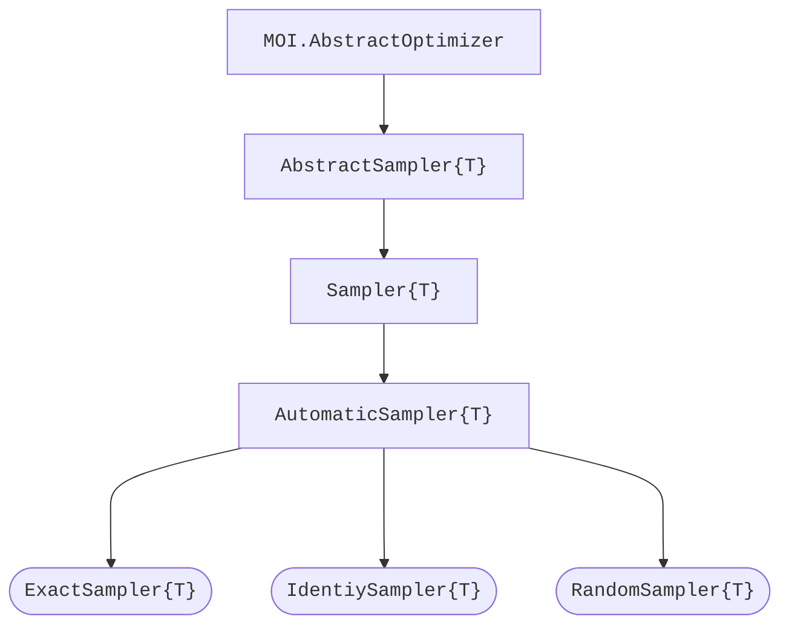

# Anneal.jl 🔴🟢🟣🔵

<div align="center">
    <a href="/docs/src/assets/">
        
    </a>
    <br>
    <br>
    <a href="https://codecov.io/gh/psrenergy/Anneal.jl">
        
    </a>
    <a href="https://psrenergy.github.io/Anneal.jl/dev">
        
    </a>
    <a href="https://github.com/psrenergy/Anneal.jl/actions/workflows/ci.yml">
        
    </a>
    <a href="https://doi.org/10.5281/zenodo.6390515">
        
    </a>
</div>

## Introduction
This package aims to provide a common [MOI](https://github.com/jump-dev/MathOptInterface.jl)-compliant API for [QUBO](https://en.wikipedia.org/wiki/Quadratic_unconstrained_binary_optimization) Sampling & Annealing machines. It also contains a few testing tools, including utility samplers for performance comparison and sanity checks, and some basic analysis features.

### QUBO
Problems assigned to solvers defined within Anneal.jl's interface are given by

$$
\begin{array}{rl}
\text{QUBO}:~ \min & \vec{x}' Q \vec{x} \\
      \text{s.t.} & \vec{x} \in \mathbb{B}^{n}
\end{array}
$$

where $Q \in \mathbb{R}^{n \times n}$ is a symmetric matrix. Maximization is automatically converted to minimization in a transparent fashion during runtime.

## Quick Start

### Installation
```julia
pkg> add Anneal
```
or
```julia
julia> import Pkg; Pkg.add("Anneal")
``` 

### Example
```julia
using JuMP
using Anneal

model = Model(ExactSampler.Optimizer)

Q = [ 1.0  2.0 -3.0
      2.0 -1.5 -2.0
     -3.0 -2.0  0.5 ]

@variable(model, x[i = 1:3], Bin)
@objective(model, Min, x' * Q * x)

optimize!(model)

for i = 1:result_count(model)
    xᵢ = value.(x; result=i)
    yᵢ = objective_value(model; result=i)
    println("f($xᵢ) = $yᵢ")
end
```

### Samplers
| Module Name       | Descripition                                                                                                                                               | Package                                             | Status |
| :---------------- | :--------------------------------------------------------------------------------------------------------------------------------------------------------- | :-------------------------------------------------- | :----: |
| `ExactSampler`    | Sequentially samples all possible states by exaustive enumeration. Finds the global optimum but can't be used for models with much more than 20 variables. | [Anneal.jl](https://github.com/psrenergy/Anneal.jl) |   ✔️    |
| `IdentitySampler` | Samples the exact same state defined as warm start.                                                                                                        | [Anneal.jl](https://github.com/psrenergy/Anneal.jl) |   ✔️    |
| `RandomSampler`   | Randomly samples states by regular or biased coin tossing. It is commonly used to compare new solving methods to a _random guessing_ baseline.             | [Anneal.jl](https://github.com/psrenergy/Anneal.jl) |   ✔️    |

### Interface (aka. integrating your own sampler)

