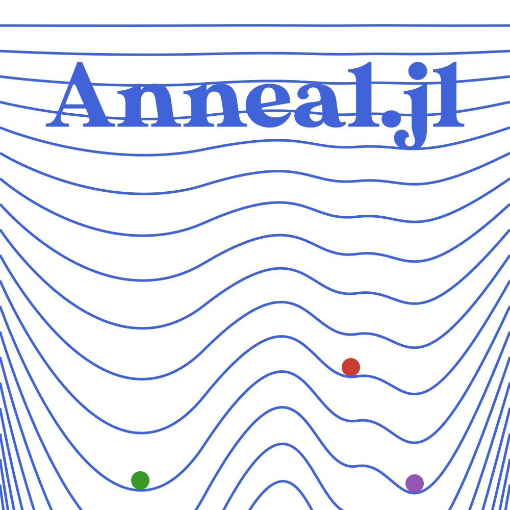

# Anneal.jl's Assets

## [Logo](@id logo)

Anneal.jl's logo aims to illustrate the annealing process with a progressive addition of the energy landscape.

## Colors

The colors were chosen according to  *Julia's Reference for logo graphics*[¹](#1). Text color matches the innermost shape and renders fairly well in both light and dark background themes.

## Typography
*MADETYPE Sunflower*[²](#2) Font was used. It was converted to a SVG path through the *Google Font to Svg Path*[³](#3) online tool.

<a href="#1">¹</a> [github.com/JuliaLang/julia-logo-graphics](https://github.com/JuliaLang/julia-logo-graphics/)

<a href="#2">²</a> [Licensed](./fonts/Sunflower-LICENSE.txt) by the authors for use in this project

<a href="#3">³</a> [danmarshall.github.io/google-font-to-svg-path](https://danmarshall.github.io/google-font-to-svg-path/)